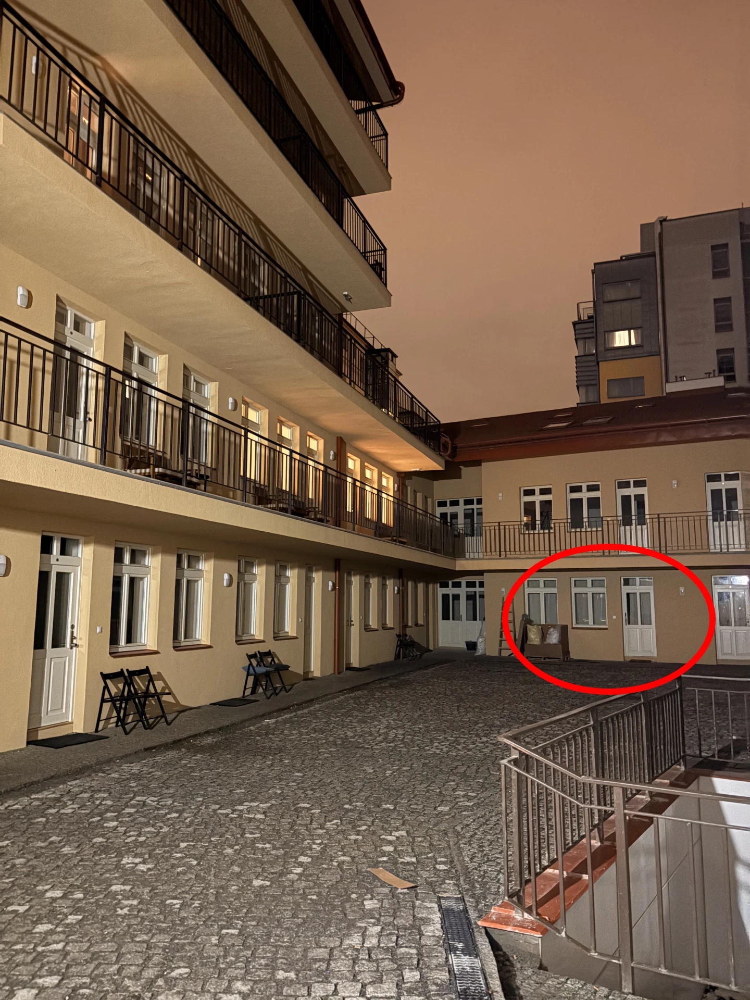

# Access to the Property

To access the property, you will need two PINs. We will share them with you
before your arrival.

From the street, enter through the gate using a 4-digit PIN. Press the key
symbol 🔑 before entering the PIN and press the key symbol 🔑 again after the
PIN.

Example: 🔑XXXX🔑

Walk through the yard; at the end you’ll find **Flat 117**. To enter the
building, use the second PIN. The apartment door has no handle—after entering
the PIN, you’ll hear it unlock, then simply push the door to open it.

When leaving the property, you can also **lock the door using the
chevron symbol** `◀` on the keypad.

