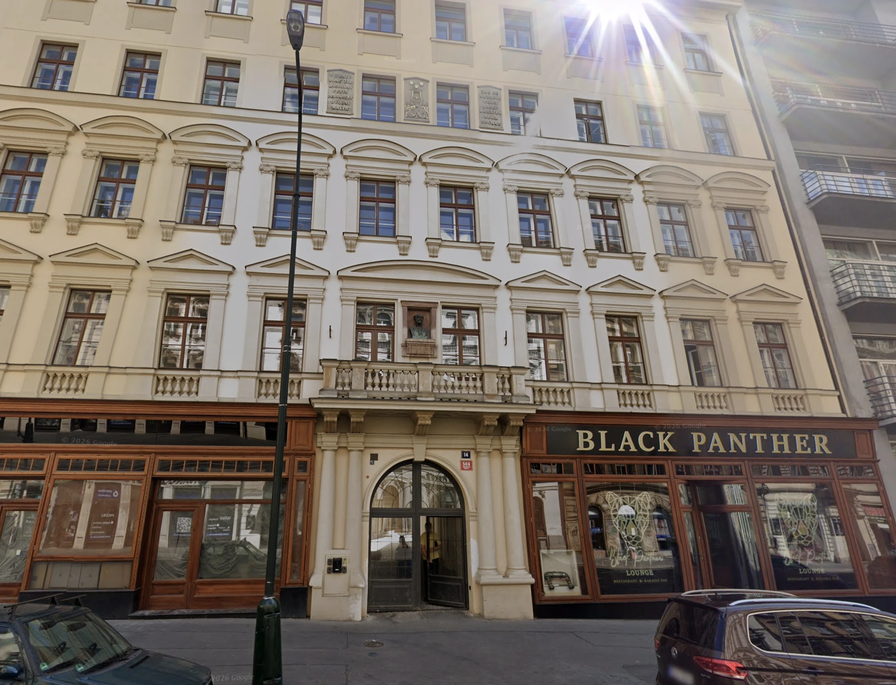

# Welcome to Our Apartment

Enjoy a stay in a modern apartment in the very center of Prague. The apartment
is located in a newly built building in a quiet courtyard of a historic house
where the composer Antonín Dvořák once lived.

Just 1 minute walk from Karlovo Náměstí, with tram and metro stops within
walking distance, it’s an ideal base for exploring the city. The street offers
shops, cafés, bars, and traditional Czech pubs, while the apartment itself
remains calm and peaceful.

## Explore this Site

You can use this site’s navigation on the left to explore everything you need to
know about your stay at the apartment. Here, you’ll find helpful guides on how
to get to the apartment, details on how to use the appliances during your stay
and tips for getting around in Prague.

You can download the content of this site as a PDF:
[guide.pdf](./public/guide.pdf).

## Getting Around in Prague (YouTube)

If you’re planning to visit Prague or just want an insider’s perspective on the
city, I highly recommend the
[Honest Guide](https://www.youtube.com/@HONESTGUIDE) YouTube channel. It’s full
of practical tips, from navigating tourist traps and finding authentic local
spots to avoiding scams and understanding public transport. The host presents
everything in a clear, entertaining, and honest way, making it both informative
and fun to watch. Whether you’re a first-time visitor or a repeat traveler,
Honest Guide is an excellent resource to get the most out of your time in
Prague.
